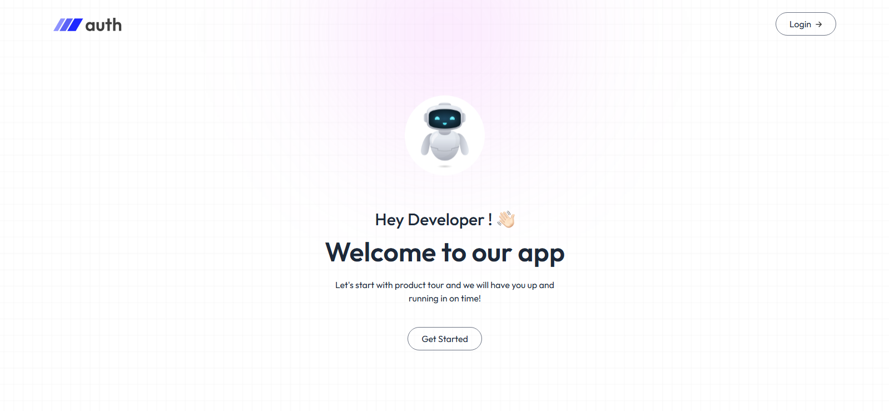

#    MERN STACK PROJECT


<p>
This project all about Authentication.

 Authentication is the process of verifying the identity of a user, device, or other entity. It confirms that someone or something is who or what they claim to be. This is usually done by checking credentials like usernames and passwords, or by using other methods like biometrics or security tokens. 

</p>

# MERN Authentication App 🔐

A full-stack Authentication system built using the MERN stack (MongoDB, Express, React, Node.js). This app supports user registration, login, protected routes, token-based authentication using JWT, and logout functionality.

## 🔗 Live Demo

[Click here to view live](https://your-live-link.com) (Replace with your deployed app link)

---

## 🚀 Features

- 🔒 User Registration & Login
- ✅ JWT-based Authentication
- 👨‍💻 Protected Routes for Logged-in Users
- 🧠 Password Hashing with Bcrypt
- 📦 Clean Folder Structure
- ⚠️ Error Handling
- 🍪 Token storage using HTTP-only cookies / localStorage (based on your choice)

---

## 🛠️ Tech Stack

### Frontend
- React
- Axios
- React Router DOM
- Tailwind CSS (or your choice of styling)

### Backend
- Node.js
- Express.js
- MongoDB (via Mongoose)
- JSON Web Token (JWT)
- Bcrypt.js
- Cookie-parser (if using HTTP-only cookies)

---

## 📸 Screenshots


  


---

## 📁 Project Structure

```bash
├── client
│   ├── src
│   │   ├── components
│   │   ├── pages
│   │   ├── App.js
│   │   └── index.js
│   └── package.json
├── server
│   ├── controllers
│   ├── models
│   ├── routes
│   ├── middleware
│   ├── server.js
│   └── package.json
└── README.md

